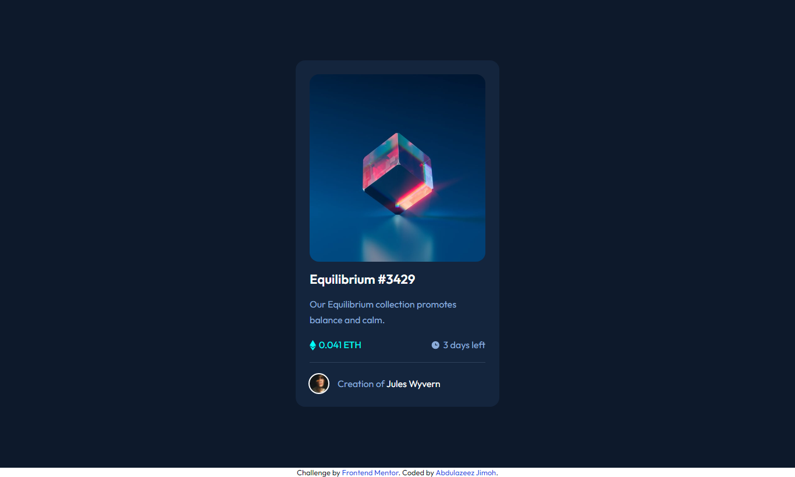

# Frontend Mentor - NFT preview card component solution


This is a solution to the [NFT preview card component challenge on Frontend Mentor](https://www.frontendmentor.io/challenges/nft-preview-card-component-SbdUL_w0U). Frontend Mentor challenges help you improve your coding skills by building realistic projects. 

## Table of contents

- [Overview](#overview)
  - [The challenge](#the-challenge)
  - [Screenshot](#screenshot)
  - [Links](#links)
- [My process](#my-process)
  - [Built with](#built-with)
  - [What I learned](#what-i-learned)
  - [Useful resources](#useful-resources)
- [Author](#author)

**Note: Delete this note and update the table of contents based on what sections you keep.**

## Overview

### The challenge

Users should be able to:

- View the optimal layout depending on their device's screen size
- See hover states for interactive elements

### Screenshot



### Links

- Solution URL: [Add solution URL here](https://your-solution-url.com)
- Live Site URL: [Add live site URL here](https://your-live-site-url.com)

## My process

### Built with

- HTML5 markup
- Flexbox
- SCSS
- Mobile-first workflow

### What I learned

During the project I learnt SCSS, and some other CSS ideas like use of `vw`, `vh`, and `rem`. See below for code snippet:


```css
/* Add semi-transparent color layer over background-image on hover */
.nft-image {
    height: 74.13vw;
    width: 74.13vw;
    border-radius: 1rem;
    background-image: url("/assets/images/image-equilibrium.jpg");
    background-size: cover;
    background-repeat: repeat;
    background-position: center;
    position: relative;
}

.nft-image:hover::after {
    content: "";
    background: hsla(178, 100%, 50%, 0.5) url("/assets/images/icon-view.svg")
        center no-repeat;
    position: absolute;
    border-radius: 1rem;
    top: 0;
    left: 0;
    right: 0;
    bottom: 0;
    z-index: 1;
    cursor: pointer;
}
```
```scss
// Calculation in SCSS
.card {
    max-width: 350px;
    padding: .064 * 375px;
}

.nft-image {
    width: 100%;
    height: .86 * 375px;
}
```


### Useful resources

- [Stackoverflow 1](https://stackoverflow.com/a/21057727) - This helped me adding semi-transparent color layer over background-image on hover. I really liked this pattern and will use it going forward.
- [Turorials Point](https://www.tutorialspoint.com/sass/number_operations.htm) - This is an amazing article which helped me in number calculation in `SCSS`. I'd recommend it to anyone still learning this concept.


## Author

- Website - [Abdulazeez Jimoh](https://abdulazeezoj.github.io)
- Frontend Mentor - [@abdulazeezoj](https://www.frontendmentor.io/profile/abdulazeezoj)
- Twitter - [@abdulazeez](https://www.twitter.com/abdulazeezoj)
- LinkedIn - [@abdulazeez-oj](https://www.linkedin.com/in/abdulazeez-oj)
